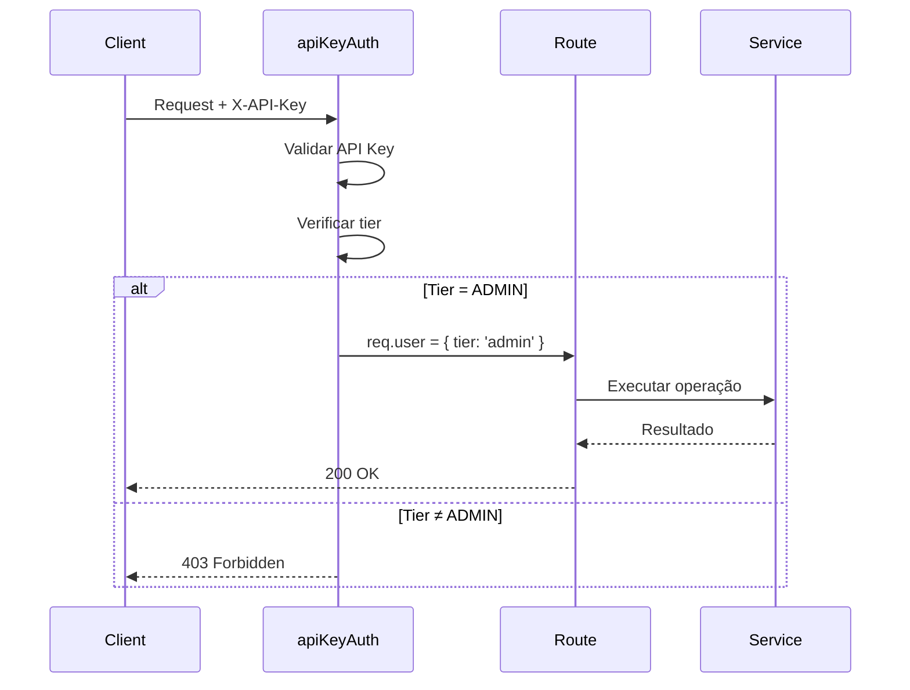

# Admin Routes - Gerenciamento de API Keys e Rate Limiting

## 📋 Visão Geral

**Arquivo:** `src/api/admin/routes/admin.routes.ts`
**Tipo:** Rotas administrativas (Express Router)
**Autenticação:** API Key com tier ADMIN (obrigatório)

Este módulo fornece endpoints para administradores gerenciarem:
- 🔑 **API Keys** → Listar, gerar, revogar
- 📊 **Rate Limiting** → Estatísticas, reset de contadores
- 👥 **Usuários** → Atualizar tier, gerenciar permissões

---

## 🔐 Autenticação e Autorização

### Requisitos de Acesso

| Requisito | Detalhe |
|-----------|---------|
| **Header** | `X-API-Key: <admin-key>` |
| **Tier** | ADMIN (obrigatório) |
| **Middleware** | `apiKeyAuth` |

### Hierarquia de Tiers


**Apenas tier ADMIN** tem acesso a estas rotas.

### Exemplo de Header

```bash
curl -H "X-API-Key: admin-key-superuser" \
  http://localhost:3000/admin/api-keys
```

---

## 📍 Endpoints Disponíveis

### Resumo

| Método | Endpoint | Descrição |
|--------|----------|-----------|
| GET | `/admin/api-keys` | Listar todas as API Keys |
| POST | `/admin/api-keys/generate` | Gerar nova API Key |
| POST | `/admin/api-keys/:apiKey/revoke` | Revogar API Key |
| GET | `/admin/rate-limit/stats` | Estatísticas de rate limit |
| POST | `/admin/rate-limit/reset/:userId` | Resetar rate limit de usuário |
| PUT | `/admin/users/:userId/tier` | Atualizar tier de usuário |

---

## 🔑 Gerenciamento de API Keys

### 1️⃣ Listar todas as API Keys

**Endpoint:** `GET /admin/api-keys`

**Descrição:** Retorna estatísticas de todas as API Keys cadastradas no sistema.

#### Request

```bash
curl -H "X-API-Key: admin-key-superuser" \
  http://localhost:3000/admin/api-keys
```

#### Response (200 OK)

```json
{
  "success": true,
  "data": {
    "total": 4,
    "active": 4,
    "inactive": 0,
    "byTier": {
      "free": 1,
      "premium": 1,
      "enterprise": 1,
      "admin": 1
    }
  },
  "correlationId": "550e8400-e29b-41d4-a716-446655440000"
}
```

#### Responses

| Status | Descrição |
|--------|-----------|
| 200 | Sucesso - Estatísticas retornadas |
| 401 | Não autenticado - API Key ausente ou inválida |
| 403 | Não autorizado - Tier diferente de ADMIN |

#### Estrutura do Response

| Campo | Tipo | Descrição |
|-------|------|-----------|
| `total` | number | Total de API Keys cadastradas |
| `active` | number | API Keys ativas |
| `inactive` | number | API Keys revogadas |
| `byTier` | object | Quantidade por tier |

---

### 2️⃣ Gerar nova API Key

**Endpoint:** `POST /admin/api-keys/generate`

**Descrição:** Cria uma nova API Key para um usuário com tier específico.

#### Request Body

```json
{
  "userId": "user-999",
  "userName": "New User",
  "tier": "premium",
  "expiresInDays": 30
}
```

#### Campos Obrigatórios

| Campo | Tipo | Descrição | Validação |
|-------|------|-----------|-----------|
| `userId` | string | ID único do usuário | Obrigatório |
| `userName` | string | Nome do usuário | Obrigatório |
| `tier` | string | Tier da API Key | Obrigatório, enum: free, premium, enterprise, admin |
| `expiresInDays` | number | Dias até expiração | Opcional (sem expiração se omitido) |

#### Request Completo

```bash
curl -X POST \
  -H "X-API-Key: admin-key-superuser" \
  -H "Content-Type: application/json" \
  -d '{
    "userId": "user-999",
    "userName": "New User",
    "tier": "premium",
    "expiresInDays": 30
  }' \
  http://localhost:3000/admin/api-keys/generate
```

#### Response (200 OK)

```json
{
  "success": true,
  "data": {
    "apiKey": "premium-a1b2c3d4e5f6g7h8i9j0",
    "userId": "user-999",
    "userName": "New User",
    "tier": "premium",
    "expiresInDays": 30
  },
  "correlationId": "550e8400-e29b-41d4-a716-446655440000"
}
```

#### Response (400 Bad Request) - Campos ausentes

```json
{
  "error": "ValidationError",
  "message": "userId, userName e tier são obrigatórios",
  "details": {
    "userId": "Obrigatório",
    "tier": "Obrigatório"
  },
  "timestamp": "2025-10-07T12:00:00.000Z",
  "path": "/admin/api-keys/generate",
  "correlationId": "550e8400-e29b-41d4-a716-446655440000"
}
```

#### Tiers Disponíveis

| Tier | Limites | Descrição |
|------|---------|-----------|
| **free** | 10/min, 100/h, 1000/dia | Plano gratuito |
| **premium** | 60/min, 1000/h, 10000/dia | Plano pago básico |
| **enterprise** | 300/min, 10000/h, 100000/dia | Plano corporativo |
| **admin** | 1000/min, 50000/h, 1000000/dia | Acesso administrativo |

#### Formato da API Key Gerada

```
{tier}-{randomHex20}

Exemplos:
- free-a1b2c3d4e5f6g7h8i9j0
- premium-x9y8z7w6v5u4t3s2r1q0
- enterprise-p0o9i8u7y6t5r4e3w2q1
- admin-m9n8b7v6c5x4z3a2s1d0
```

---

### 3️⃣ Revogar API Key

**Endpoint:** `POST /admin/api-keys/:apiKey/revoke`

**Descrição:** Revoga uma API Key existente, marcando-a como inativa. A key permanece no sistema para auditoria.

#### Request

```bash
curl -X POST \
  -H "X-API-Key: admin-key-superuser" \
  http://localhost:3000/admin/api-keys/free-demo-key-123456/revoke
```

#### Response (200 OK) - Sucesso

```json
{
  "success": true,
  "message": "API Key revogada",
  "correlationId": "550e8400-e29b-41d4-a716-446655440000"
}
```

#### Response (200 OK) - Key não encontrada

```json
{
  "success": false,
  "message": "API Key não encontrada",
  "correlationId": "550e8400-e29b-41d4-a716-446655440000"
}
```

#### Comportamento

- ✅ **Key encontrada** → Marcada como inativa
- ❌ **Key não encontrada** → Retorna `success: false`
- 🔒 **Sem remoção física** → Key permanece para auditoria
- ⏱️ **Efeito imediato** → Próxima requisição será rejeitada

#### Auditoria

A key revogada permanece visível em:
- `/admin/api-keys` → Contada em `inactive`
- Logs de auditoria → Histórico preservado

---

## 📊 Gerenciamento de Rate Limiting

### 4️⃣ Estatísticas de Rate Limit

**Endpoint:** `GET /admin/rate-limit/stats`

**Descrição:** Retorna estatísticas de rate limiting (globais ou de usuário específico).

#### Request (Estatísticas Globais)

```bash
curl -H "X-API-Key: admin-key-superuser" \
  http://localhost:3000/admin/rate-limit/stats
```

#### Request (Usuário Específico)

```bash
curl -H "X-API-Key: admin-key-superuser" \
  "http://localhost:3000/admin/rate-limit/stats?userId=user-001"
```

#### Query Parameters

| Parâmetro | Tipo | Descrição | Obrigatório |
|-----------|------|-----------|-------------|
| `userId` | string | ID do usuário | Não (retorna stats globais se omitido) |

#### Response (Usuário Específico)

```json
{
  "success": true,
  "data": {
    "userId": "user-001",
    "tier": "free",
    "usage": {
      "minute": {
        "current": 8,
        "limit": 10,
        "remaining": 2,
        "resetAt": "2025-10-07T12:01:00.000Z"
      },
      "hour": {
        "current": 45,
        "limit": 100,
        "remaining": 55,
        "resetAt": "2025-10-07T13:00:00.000Z"
      },
      "day": {
        "current": 234,
        "limit": 1000,
        "remaining": 766,
        "resetAt": "2025-10-08T00:00:00.000Z"
      }
    }
  },
  "correlationId": "550e8400-e29b-41d4-a716-446655440000"
}
```

#### Response (Estatísticas Globais)

```json
{
  "success": true,
  "data": {
    "totalUsers": 15,
    "activeUsers": 8,
    "requestsLastHour": 1247,
    "topUsers": [
      { "userId": "user-001", "requests": 234 },
      { "userId": "user-002", "requests": 189 },
      { "userId": "user-003", "requests": 156 }
    ]
  },
  "correlationId": "550e8400-e29b-41d4-a716-446655440000"
}
```

#### Casos de Uso

| Caso | Query | Retorno |
|------|-------|---------|
| Monitoramento geral | Sem `userId` | Estatísticas globais |
| Debug de usuário | Com `userId` | Detalhes de uso e limites |
| Análise de pico | Sem `userId` | Top usuários por requisições |

---

### 5️⃣ Resetar Rate Limit de Usuário

**Endpoint:** `POST /admin/rate-limit/reset/:userId`

**Descrição:** Limpa todos os contadores (minute, hour, day) de um usuário específico.

#### Request

```bash
curl -X POST \
  -H "X-API-Key: admin-key-superuser" \
  http://localhost:3000/admin/rate-limit/reset/user-001
```

#### Response (200 OK)

```json
{
  "success": true,
  "message": "Rate limit resetado para usuário user-001",
  "correlationId": "550e8400-e29b-41d4-a716-446655440000"
}
```

#### Comportamento

- 🔄 **Reset completo** → Todos contadores zerados (minute, hour, day)
- ⚡ **Efeito imediato** → Próxima requisição terá limites completos
- 📝 **Auditoria** → Operação registrada em logs

#### Quando Usar

| Situação | Descrição |
|----------|-----------|
| **Testes** | Resetar contadores após testes de integração |
| **Falso positivo** | Usuário bloqueado indevidamente |
| **Exceção administrativa** | Conceder requisições extras temporariamente |
| **Debug** | Limpar estado para reproduzir problema |

#### Exemplo de Uso

```bash
# Usuário atingiu limite durante teste
curl -X POST \
  -H "X-API-Key: admin-key-superuser" \
  http://localhost:3000/admin/rate-limit/reset/test-user-001

# Verificar que foi resetado
curl -H "X-API-Key: admin-key-superuser" \
  "http://localhost:3000/admin/rate-limit/stats?userId=test-user-001"

# Resultado:
# {
#   "usage": {
#     "minute": { "current": 0, "limit": 10, "remaining": 10 },
#     "hour": { "current": 0, "limit": 100, "remaining": 100 },
#     "day": { "current": 0, "limit": 1000, "remaining": 1000 }
#   }
# }
```

---

## 👥 Gerenciamento de Usuários

### 6️⃣ Atualizar Tier de Usuário

**Endpoint:** `PUT /admin/users/:userId/tier`

**Descrição:** Atualiza o tier de um usuário, modificando todas as suas API Keys e limites de rate limiting automaticamente.

#### Request Body

```json
{
  "tier": "enterprise"
}
```

#### Request Completo

```bash
curl -X PUT \
  -H "X-API-Key: admin-key-superuser" \
  -H "Content-Type: application/json" \
  -d '{"tier": "enterprise"}' \
  http://localhost:3000/admin/users/user-001/tier
```

#### Response (200 OK)

```json
{
  "success": true,
  "message": "Tier atualizado para enterprise",
  "data": {
    "userId": "user-001",
    "tier": "enterprise"
  },
  "correlationId": "550e8400-e29b-41d4-a716-446655440000"
}
```

#### Response (400 Bad Request) - Tier inválido

```json
{
  "error": "ValidationError",
  "message": "Tier inválido",
  "details": {
    "tier": "Deve ser: free, premium, enterprise, admin"
  },
  "timestamp": "2025-10-07T12:00:00.000Z",
  "path": "/admin/users/user-001/tier",
  "correlationId": "550e8400-e29b-41d4-a716-446655440000"
}
```

#### Tiers Disponíveis

| Tier | req/min | req/h | req/dia | Preço |
|------|---------|-------|---------|-------|
| **free** | 10 | 100 | 1.000 | Grátis |
| **premium** | 60 | 1.000 | 10.000 | R$ 49/mês |
| **enterprise** | 300 | 10.000 | 100.000 | R$ 499/mês |
| **admin** | 1.000 | 50.000 | 1.000.000 | N/A |

#### Comportamento

- ✅ **API Keys atualizadas** → Todas keys do usuário recebem novo tier
- ✅ **Rate limits atualizados** → Limites ajustados imediatamente
- ✅ **Contadores preservados** → Uso atual não é resetado
- 📝 **Auditoria** → Mudança registrada em logs

#### Exemplo de Fluxo

```bash
# 1. Verificar tier atual
curl -H "X-API-Key: admin-key-superuser" \
  "http://localhost:3000/admin/rate-limit/stats?userId=user-001"
# Resultado: tier: "free", limit: 10/min

# 2. Atualizar para premium
curl -X PUT \
  -H "X-API-Key: admin-key-superuser" \
  -H "Content-Type: application/json" \
  -d '{"tier": "premium"}' \
  http://localhost:3000/admin/users/user-001/tier

# 3. Verificar novo tier
curl -H "X-API-Key: admin-key-superuser" \
  "http://localhost:3000/admin/rate-limit/stats?userId=user-001"
# Resultado: tier: "premium", limit: 60/min
```

---

## 🔒 Segurança

### Validação de Acesso

**Todos os endpoints validam:**

```typescript
if (req.user?.tier !== UserTier.ADMIN) {
  throw new AuthorizationError('Apenas administradores podem...');
}
```

### Fluxo de Autenticação



### Headers Esperados

```bash
X-API-Key: admin-key-superuser    # Obrigatório
Content-Type: application/json    # Para POST/PUT
```

---

## 🔍 Troubleshooting

### Problema: 401 Unauthorized

**Causa:** API Key ausente ou inválida.

**Solução:**
```bash
# Verificar se header está correto
curl -v -H "X-API-Key: admin-key-superuser" \
  http://localhost:3000/admin/api-keys

# Verificar se API Key é válida
curl -H "X-API-Key: admin-key-superuser" \
  http://localhost:3000/health
```

---

### Problema: 403 Forbidden

**Causa:** API Key válida, mas tier diferente de ADMIN.

**Response:**
```json
{
  "error": "AuthorizationError",
  "message": "Apenas administradores podem listar todas as API Keys",
  "timestamp": "2025-10-07T12:00:00.000Z"
}
```

**Solução:**
- Usar API Key com tier ADMIN
- Verificar tier da key atual: `GET /admin/rate-limit/stats?userId=<userId>`

---

### Problema: 400 Bad Request - Campos ausentes

**Causa:** Campos obrigatórios não fornecidos.

**Response:**
```json
{
  "error": "ValidationError",
  "message": "userId, userName e tier são obrigatórios",
  "details": {
    "userId": "Obrigatório",
    "tier": "Obrigatório"
  }
}
```

**Solução:**
- Incluir todos campos obrigatórios no body
- Verificar formato JSON

---

### Problema: 400 Bad Request - Tier inválido

**Causa:** Valor de tier não pertence ao enum.

**Response:**
```json
{
  "error": "ValidationError",
  "message": "Tier inválido",
  "details": {
    "tier": "Deve ser: free, premium, enterprise, admin"
  }
}
```

**Solução:**
- Usar apenas valores válidos: `free`, `premium`, `enterprise`, `admin`
- Verificar case-sensitive (deve ser lowercase)

---

### Problema: API Key não encontrada ao revogar

**Response:**
```json
{
  "success": false,
  "message": "API Key não encontrada"
}
```

**Causas possíveis:**
- API Key já foi revogada anteriormente
- Typo na API Key fornecida
- API Key nunca existiu

**Verificação:**
```bash
# Listar todas as keys
curl -H "X-API-Key: admin-key-superuser" \
  http://localhost:3000/admin/api-keys
```

---

## 📚 Casos de Uso

### Caso 1: Onboarding de Novo Cliente

```bash
# 1. Gerar API Key para cliente
curl -X POST \
  -H "X-API-Key: admin-key-superuser" \
  -H "Content-Type: application/json" \
  -d '{
    "userId": "client-acme-corp",
    "userName": "ACME Corporation",
    "tier": "premium",
    "expiresInDays": 365
  }' \
  http://localhost:3000/admin/api-keys/generate

# Resultado:
# {
#   "success": true,
#   "data": {
#     "apiKey": "premium-x9y8z7w6v5u4t3s2r1q0",
#     "tier": "premium"
#   }
# }

# 2. Enviar API Key para cliente
# (email, dashboard, etc.)
```

---

### Caso 2: Upgrade de Plano

```bash
# Cliente comprou upgrade: Free → Premium
curl -X PUT \
  -H "X-API-Key: admin-key-superuser" \
  -H "Content-Type: application/json" \
  -d '{"tier": "premium"}' \
  http://localhost:3000/admin/users/client-startup/tier

# Verificar novo tier
curl -H "X-API-Key: admin-key-superuser" \
  "http://localhost:3000/admin/rate-limit/stats?userId=client-startup"

# Resultado:
# {
#   "tier": "premium",
#   "usage": {
#     "minute": { "limit": 60 },  // Era 10, agora 60
#     "hour": { "limit": 1000 }    // Era 100, agora 1000
#   }
# }
```

---

### Caso 3: Cancelamento de Conta

```bash
# 1. Listar API Keys do usuário
curl -H "X-API-Key: admin-key-superuser" \
  http://localhost:3000/admin/api-keys

# 2. Revogar todas as keys do usuário
curl -X POST \
  -H "X-API-Key: admin-key-superuser" \
  http://localhost:3000/admin/api-keys/premium-x9y8z7w6v5u4t3s2r1q0/revoke

# 3. Verificar que key está inativa
curl -H "X-API-Key: admin-key-superuser" \
  http://localhost:3000/admin/api-keys
# Resultado: "inactive": 1
```

---

### Caso 4: Monitoramento de Uso

```bash
# Dashboard de admin - verificar top usuários
curl -H "X-API-Key: admin-key-superuser" \
  http://localhost:3000/admin/rate-limit/stats

# Investigar usuário específico com alto uso
curl -H "X-API-Key: admin-key-superuser" \
  "http://localhost:3000/admin/rate-limit/stats?userId=power-user-001"

# Se necessário, resetar limites temporariamente
curl -X POST \
  -H "X-API-Key: admin-key-superuser" \
  http://localhost:3000/admin/rate-limit/reset/power-user-001
```

---

### Caso 5: Auditoria e Compliance

```bash
# Listar todas as API Keys ativas/inativas
curl -H "X-API-Key: admin-key-superuser" \
  http://localhost:3000/admin/api-keys

# Resultado permite verificar:
# - Quantas keys ativas
# - Distribuição por tier
# - Total de usuários

# Logs detalhados em:
# - Geração de keys (quem, quando, qual tier)
# - Revogações (quem revogou, quando)
# - Mudanças de tier (de qual para qual, quando)
```

---

## 📖 Exemplos Completos

### Postman Collection

```json
{
  "info": {
    "name": "Admin Routes",
    "schema": "https://schema.getpostman.com/json/collection/v2.1.0/collection.json"
  },
  "item": [
    {
      "name": "List API Keys",
      "request": {
        "method": "GET",
        "header": [
          {
            "key": "X-API-Key",
            "value": "{{adminApiKey}}"
          }
        ],
        "url": "{{baseUrl}}/admin/api-keys"
      }
    },
    {
      "name": "Generate API Key",
      "request": {
        "method": "POST",
        "header": [
          {
            "key": "X-API-Key",
            "value": "{{adminApiKey}}"
          },
          {
            "key": "Content-Type",
            "value": "application/json"
          }
        ],
        "body": {
          "mode": "raw",
          "raw": "{\n  \"userId\": \"new-user-001\",\n  \"userName\": \"New User\",\n  \"tier\": \"premium\",\n  \"expiresInDays\": 30\n}"
        },
        "url": "{{baseUrl}}/admin/api-keys/generate"
      }
    },
    {
      "name": "Revoke API Key",
      "request": {
        "method": "POST",
        "header": [
          {
            "key": "X-API-Key",
            "value": "{{adminApiKey}}"
          }
        ],
        "url": "{{baseUrl}}/admin/api-keys/{{targetApiKey}}/revoke"
      }
    },
    {
      "name": "Rate Limit Stats",
      "request": {
        "method": "GET",
        "header": [
          {
            "key": "X-API-Key",
            "value": "{{adminApiKey}}"
          }
        ],
        "url": {
          "raw": "{{baseUrl}}/admin/rate-limit/stats?userId={{userId}}",
          "host": ["{{baseUrl}}"],
          "path": ["admin", "rate-limit", "stats"],
          "query": [
            {
              "key": "userId",
              "value": "{{userId}}"
            }
          ]
        }
      }
    },
    {
      "name": "Reset Rate Limit",
      "request": {
        "method": "POST",
        "header": [
          {
            "key": "X-API-Key",
            "value": "{{adminApiKey}}"
          }
        ],
        "url": "{{baseUrl}}/admin/rate-limit/reset/{{userId}}"
      }
    },
    {
      "name": "Update User Tier",
      "request": {
        "method": "PUT",
        "header": [
          {
            "key": "X-API-Key",
            "value": "{{adminApiKey}}"
          },
          {
            "key": "Content-Type",
            "value": "application/json"
          }
        ],
        "body": {
          "mode": "raw",
          "raw": "{\n  \"tier\": \"enterprise\"\n}"
        },
        "url": "{{baseUrl}}/admin/users/{{userId}}/tier"
      }
    }
  ],
  "variable": [
    {
      "key": "baseUrl",
      "value": "http://localhost:3000"
    },
    {
      "key": "adminApiKey",
      "value": "admin-key-superuser"
    }
  ]
}
```

---

## 🎯 Boas Práticas

### ✅ DO

- ✅ **Sempre usar HTTPS** em produção para proteger API Keys
- ✅ **Rodar auditoria periódica** das API Keys ativas
- ✅ **Revogar keys** de usuários inativos
- ✅ **Monitorar rate limits** para detectar abuso
- ✅ **Documentar mudanças** de tier em sistema externo
- ✅ **Usar `expiresInDays`** para keys temporárias (testes, demos)

### ❌ DON'T

- ❌ **Não compartilhar** admin API Key
- ❌ **Não logar** API Keys completas (usar apenas prefixo)
- ❌ **Não deletar** keys fisicamente (revogar para preservar auditoria)
- ❌ **Não expor** admin routes sem autenticação
- ❌ **Não permitir** usuários comuns acessarem admin routes

---

## 🔗 Dependências

### Módulos Importados

```typescript
import { Router, Request, Response } from 'express';
import { ApiKeyService } from '@shared/services/apiKey.service';
import { UserRateLimiter } from '@shared/utils/UserRateLimiter';
import { UserTier } from '@shared/types/apiKey.types';
import { apiKeyAuth } from '@shared/middlewares/apiKeyAuth.middleware';
import { AuthorizationError, ValidationError } from '@shared/errors/errors';
```

### Services Utilizados

- **ApiKeyService** → Gerenciamento de API Keys (CRUD, geração, revogação)
- **UserRateLimiter** → Controle de rate limiting (stats, reset)

### Middlewares

- **apiKeyAuth** → Validação e autenticação de API Key

---

## 🔗 Referências

- [ApiKeyService](../shared/services/apiKey.service.ts) → Lógica de API Keys
- [UserRateLimiter](../shared/utils/UserRateLimiter.ts) → Sistema de rate limiting
- [apiKeyAuth](../shared/middlewares/apiKeyAuth.middleware.ts) → Middleware de autenticação
- [Errors](../shared/errors/) → Erros customizados
- [UserTier](../shared/types/apiKey.types.ts) → Definição de tiers

---

**Última atualização:** 2025-10-07