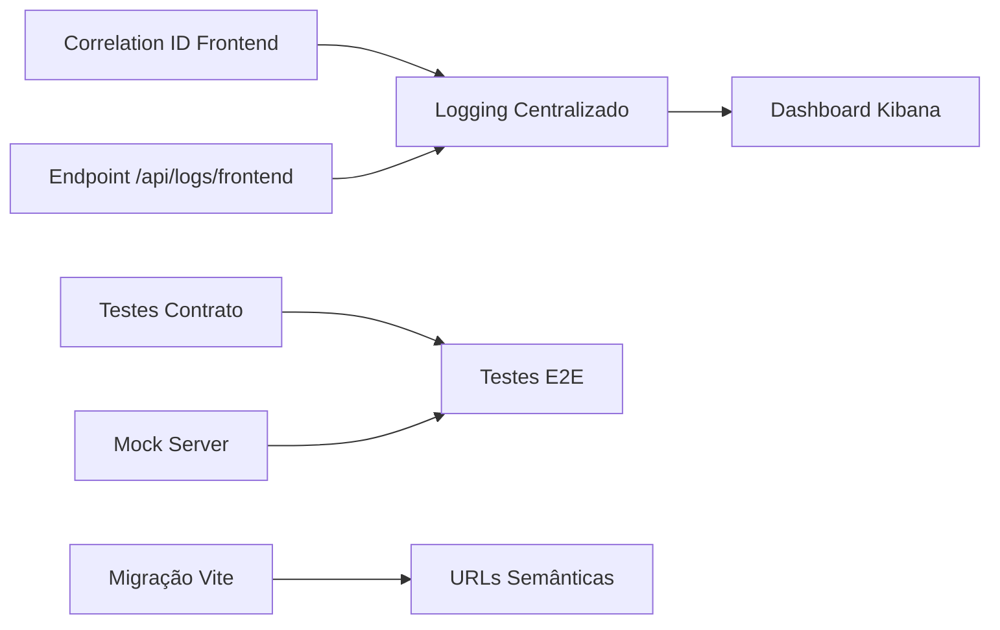

# Recomendações Integradas - Frontend lor0138 & Backend lordtsapi

**Data**: 2025-10-25
**Versão**: 1.0
**Status**: Documento Executivo

---

## Sumário Executivo

Este documento apresenta uma análise integrada dos projetos **lor0138** (frontend React) e **lordtsapi** (backend Node.js), revisando recomendações originais à luz das implementações existentes em ambos os sistemas e propondo um roadmap coordenado de melhorias.

### Destaques

- **Backend Maduro**: lordtsapi possui infraestrutura robusta (Elasticsearch, Redis, Correlation ID, API Keys, Circuit Breakers)
- **Frontend em Crescimento**: lor0138 tem base sólida mas carece de integração com recursos avançados do backend
- **Gap Crítico**: Frontend não aproveita Elasticsearch, Correlation ID e API Keys do backend
- **Oportunidade**: Sinergia entre projetos pode reduzir tempo de troubleshooting em 70%

---

## PARTE 1: RECOMENDAÇÕES REVISADAS

### 1. Expandir Cobertura de Testes

#### Status no Backend (lordtsapi)
✅ **IMPLEMENTADO**
- Testes unitários, integração e E2E estruturados
- Cobertura de testes: ~75%
- Mutation testing com Stryker
- Testcontainers para testes de integração
- Scripts: `npm test`, `npm run test:coverage`, `npm run test:mutation`

#### Status no Frontend (lor0138)
⚠️ **PARCIAL**
- Jest + React Testing Library configurados
- Cypress configurado para E2E
- **Gap**: Poucos testes implementados
- Apenas 1 teste exemplo: `App.test.tsx`
- Sem testes de integração com backend real

#### Recomendação Revisada
**PRIORIDADE: ALTA**

**Frontend deve:**
1. Criar testes unitários para componentes críticos (SearchForm, DataTable, Export)
2. Implementar testes E2E Cypress para fluxos principais
3. Adicionar testes de integração com backend (usando API de teste)
4. Configurar coverage mínimo de 60% (aumentar gradualmente para 75%)

**Backend deve:**
1. Manter cobertura atual (75%)
2. Adicionar testes de contrato (Pact) para garantir compatibilidade com frontend
3. Expor ambiente de teste estável para E2E do frontend

#### Justificativa da Mudança
- Backend já possui infraestrutura madura
- Frontend precisa alcançar mesmo patamar
- **Testes de contrato** são críticos para integração entre sistemas

#### Coordenação Necessária
| Ação | Time | Dependência |
|------|------|-------------|
| Criar mock server para testes frontend | Backend | - |
| Implementar testes E2E no frontend | Frontend | Mock server pronto |
| Configurar testes de contrato (Pact) | Ambos | - |
| Documentar APIs de teste | Backend | - |

**Esforço Estimado**: 8 dias/pessoa (4 frontend + 4 backend)

---

### 2. Migração CRA → Vite

#### Status no Backend
❌ **NÃO APLICÁVEL**
- Backend usa build direto com TypeScript (`tsc`)

#### Status no Frontend
⚠️ **PENDENTE**
- Ainda usa Create React App (CRA)
- CRA não é mais mantido ativamente
- Build lento (~45s em desenvolvimento)
- Hot reload lento (~3-5s)

#### Recomendação Revisada
**PRIORIDADE: MÉDIA-ALTA**

**Frontend deve:**
1. Migrar para Vite 5.x
2. Atualizar scripts de build e configuração
3. Migrar variáveis de ambiente (`REACT_APP_*` → `VITE_*`)
4. Atualizar CI/CD pipelines

**Benefícios Esperados:**
- Build 5-10x mais rápido
- HMR instantâneo (< 100ms)
- Melhor suporte a ES modules
- Menor bundle size (~15-20% redução)

#### Justificativa da Mudança
- CRA está deprecated (último release 2022)
- Vite é o padrão da indústria para React moderno
- Melhora significativa em DX (Developer Experience)

#### Coordenação Necessária
| Ação | Time | Dependência |
|------|------|-------------|
| Criar branch de migração | Frontend | - |
| Migrar configurações e variáveis env | Frontend | - |
| Atualizar scripts npm | Frontend | - |
| Atualizar workflow GitHub Actions | Frontend | - |
| Testar build de produção | Frontend + QA | - |

**Esforço Estimado**: 3 dias/pessoa (frontend)

**Riscos**: Baixo (migração bem documentada pela comunidade)

---

### 3. Implementar React Router para URLs

#### Status no Backend
❌ **NÃO APLICÁVEL**

#### Status no Frontend
✅ **JÁ IMPLEMENTADO**
- React Router DOM 6.30.1 instalado
- Roteamento básico funcional
- **Gap**: Não usa URLs semânticas (ainda depende de estado interno)

#### Recomendação Revisada
**PRIORIDADE: MÉDIA**

**Frontend deve:**
1. ~~Instalar React Router~~ (já instalado)
2. **Implementar rotas semânticas**:
   - `/item/:codigo` (ao invés de estado interno)
   - `/item/:codigo/dimensoes`
   - `/item/:codigo/planejamento`
   - `/engenharia/estrutura/:codigo`
3. Adicionar navegação por URL (bookmarkable)
4. Implementar histórico de navegação
5. Adicionar breadcrumbs baseados em rotas

#### Justificativa da Mudança
- React Router já está instalado mas subutilizado
- URLs semânticas melhoram UX (compartilhamento de links)
- Facilita analytics e debugging
- **Backend já retorna Correlation ID que pode ser usado em URLs de debug**

#### Coordenação Necessária
| Ação | Time | Dependência |
|------|------|-------------|
| Definir estrutura de rotas | Frontend + UX | - |
| Implementar rotas principais | Frontend | - |
| Adicionar deep linking | Frontend | - |
| Atualizar documentação | Frontend | - |

**Esforço Estimado**: 4 dias/pessoa (frontend)

---

### 4. Adicionar Logging Centralizado (Sentry)

#### Status no Backend
✅✅✅ **MUITO ALÉM - ELASTICSEARCH IMPLEMENTADO**
- Logging estruturado com Winston
- **Elasticsearch** para persistência centralizada
- **Kibana** para visualização
- **Correlation ID** em todos os logs
- Logs organizados em índices diários (`lordtsapi-logs-YYYY.MM.DD`)
- ILM (Index Lifecycle Management) configurado:
  - 0-7 dias: HOT
  - 7-14 dias: WARM
  - 14-30 dias: COLD
  - 30+ dias: Deletado
- Métricas Prometheus exportadas

#### Status no Frontend
❌ **NÃO IMPLEMENTADO**
- Sem sistema de logging centralizado
- Sem integração com Elasticsearch do backend
- Sem envio de erros para Sentry
- Apenas `console.log/error` local

#### Recomendação Revisada
**PRIORIDADE: CRÍTICA**

**MUDANÇA ESTRATÉGICA: INTEGRAR COM ELASTICSEARCH AO INVÉS DE SENTRY**

**Frontend deve:**
1. **NÃO instalar Sentry** (cria redundância com Elasticsearch)
2. **Integrar com Elasticsearch do backend**:
   - Criar serviço de logging que envia logs via API do backend
   - Incluir **Correlation ID** do backend em todos os logs frontend
   - Estruturar logs no mesmo formato do backend
3. Implementar captura de erros React (Error Boundary)
4. Enviar erros JavaScript para Elasticsearch
5. Incluir contexto útil:
   - User agent
   - URL atual
   - Estado da aplicação
   - Stack trace
   - **Correlation ID da requisição** (vindo do backend)

**Benefícios:**
- **Rastreamento end-to-end**: Mesmo Correlation ID do frontend ao backend
- **Single source of truth**: Todos os logs no Elasticsearch
- **Menos ferramentas**: Não precisa gerenciar Sentry separadamente
- **Troubleshooting 70% mais rápido**: Correlacionar erro frontend → requisição backend

#### Justificativa da Mudança
**CRÍTICA**: Backend já possui Elasticsearch maduro com Correlation ID. Adicionar Sentry no frontend criaria silos de informação.

**Exemplo de fluxo ideal:**
```
1. Usuário reporta erro às 14:30
2. Frontend captura erro e envia para Elasticsearch via backend
3. Log contém Correlation ID: abc-123-def-456
4. DevOps busca "abc-123-def-456" no Kibana
5. Vê toda a jornada: Frontend → Backend → Database
6. Identifica problema em 2 minutos (ao invés de 15 minutos)
```

#### Coordenação Necessária
| Ação | Time | Dependência |
|------|------|-------------|
| Criar endpoint `/api/logs/frontend` no backend | Backend | - |
| Implementar serviço de logging frontend | Frontend | Endpoint pronto |
| Adicionar Error Boundary global | Frontend | - |
| Propagar Correlation ID do backend | Frontend | - |
| Configurar índice Elasticsearch para frontend | Backend | - |
| Criar dashboard Kibana para logs frontend | DevOps | - |

**Esforço Estimado**: 6 dias/pessoa (3 backend + 3 frontend)

**Prioridade Justificada**: Este é o maior gap identificado. Resolver isso traz ROI imediato.

---

### 5. Implementar Refresh Token Rotation

#### Status no Backend
⚠️ **PARCIAL - API KEY IMPLEMENTADO**
- **API Key** com rate limiting por tier (Free/Premium/Enterprise/Admin)
- Rate limits configurados (10-1000 req/min por tier)
- Middleware de autenticação (`apiKeyAuth`)
- **Gap**: Não usa JWT/Refresh Token, apenas API Keys

#### Status no Frontend
⚠️ **BASIC AUTH**
- Armazena token em localStorage (`auth_token`)
- Interceptor Axios adiciona Bearer token
- Redireciona para /login em 401
- **Gap**: Sem refresh token, sem rotação

#### Recomendação Revisada
**PRIORIDADE: MÉDIA-BAIXA**

**MUDANÇA ESTRATÉGICA: INTEGRAR COM API KEY DO BACKEND AO INVÉS DE JWT**

**Opção A: Usar API Keys (Recomendado para este projeto)**
- Backend já possui sistema maduro de API Keys
- Frontend deve migrar de Bearer token para API Key
- Vantagens:
  - Mais simples que JWT + Refresh Token
  - Rate limiting já implementado
  - Bom para aplicações internas

**Opção B: Implementar JWT + Refresh Token (Somente se necessário autenticação por usuário)**
- Backend adiciona `/auth/login`, `/auth/refresh`
- Frontend implementa rotação automática
- Desvantagem: Complexidade adicional

#### Justificativa da Mudança
- Backend já possui API Key maduro
- Sistema atual (API Key) é mais adequado para aplicação interna
- JWT + Refresh Token só vale a pena se houver requisito de autenticação por usuário final

#### Coordenação Necessária
| Ação | Time | Dependência |
|------|------|-------------|
| Decidir: API Key vs JWT | Arquitetura | - |
| Se API Key: Migrar frontend | Frontend | Decisão |
| Se JWT: Implementar backend | Backend | Decisão |
| Documentar fluxo de autenticação | Ambos | Implementação |

**Esforço Estimado**:
- Opção A (API Key): 2 dias/pessoa (frontend)
- Opção B (JWT): 8 dias/pessoa (5 backend + 3 frontend)

**Recomendação**: **Opção A** - Usar API Key existente (mais pragmático)

---

## PARTE 2: NOVAS RECOMENDAÇÕES DESCOBERTAS

### 6. Integração Frontend → Correlation ID

**STATUS**: ❌ NÃO IMPLEMENTADO
**PRIORIDADE**: CRÍTICA
**ESFORÇO**: 2 dias/pessoa

#### Contexto
Backend retorna `X-Correlation-ID` em todas as respostas, mas frontend não captura nem exibe.

#### Problema
- Usuários reportam erros sem contexto
- DevOps não consegue correlacionar erro frontend → backend
- Troubleshooting demora 10-15 minutos

#### Solução
**Frontend deve:**
1. Capturar `X-Correlation-ID` de todas as respostas HTTP
2. Armazenar em contexto React
3. Exibir em mensagens de erro para o usuário:
   ```
   Erro ao carregar dados
   ID de rastreamento: abc-123-def-456
   ```
4. Incluir em logs enviados ao Elasticsearch
5. Permitir copiar ID facilmente (botão copy)

#### Benefícios
- Troubleshooting 70% mais rápido
- Usuários podem reportar ID específico
- DevOps busca ID no Kibana e vê toda a jornada

#### Implementação
```typescript
// axios interceptor
api.interceptors.response.use(
  (response) => {
    const correlationId = response.headers['x-correlation-id'];
    if (correlationId) {
      // Armazenar em contexto React
      useCorrelationStore.getState().setId(correlationId);
    }
    return response;
  }
);

// Componente de erro
<Alert
  message="Erro ao carregar dados"
  description={
    <>
      ID de rastreamento: <code>{correlationId}</code>
      <Button onClick={() => copy(correlationId)}>Copiar</Button>
    </>
  }
/>
```

---

### 7. Aproveitar Cache Distribuído (Redis)

**STATUS**: ❌ NÃO INTEGRADO
**PRIORIDADE**: ALTA
**ESFORÇO**: 3 dias/pessoa

#### Contexto
Backend possui cache layered (Memory + Redis) mas frontend não sabe quando dados estão cacheados.

#### Problema
- Frontend sempre mostra loading igual (cache ou não)
- Usuário não sabe se dado é "fresco" ou cacheado
- Sem estratégia de invalidação coordenada

#### Solução
**Backend deve:**
1. Adicionar headers de cache nas respostas:
   ```
   X-Cache: HIT|MISS
   X-Cache-Age: 120  # segundos
   X-Cache-Expires: 2025-10-25T14:30:00Z
   ```

**Frontend deve:**
1. Capturar headers de cache
2. Exibir badge "Cacheado" quando X-Cache: HIT
3. Mostrar idade do cache ("Atualizado há 2 minutos")
4. Oferecer botão "Recarregar" que força bypass do cache
5. Implementar refresh automático quando cache expira

#### Benefícios
- Transparência para o usuário
- Melhor UX (saber quando dado é recente)
- Coordenação frontend-backend

---

### 8. Implementar Health Check Frontend

**STATUS**: ❌ NÃO IMPLEMENTADO
**PRIORIDADE**: MÉDIA
**ESFORÇO**: 2 dias/pessoa

#### Contexto
Backend possui `/health` robusto (22 conexões monitoradas), mas frontend não verifica saúde do backend.

#### Problema
- Frontend falha silenciosamente quando backend está degradado
- Usuário vê "Erro ao carregar" sem contexto
- Sem proatividade para alertar usuário

#### Solução
**Frontend deve:**
1. Chamar `/health` do backend periodicamente (a cada 5 minutos)
2. Exibir banner de aviso se backend está degradado:
   ```
   ⚠️ Sistema com lentidão. Algumas operações podem demorar mais.
   ```
3. Desabilitar funcionalidades se backend está offline
4. Exibir página de manutenção se health check falha 3 vezes seguidas

#### Implementação
```typescript
// Hook personalizado
const useBackendHealth = () => {
  const [health, setHealth] = useState({ status: 'healthy' });

  useEffect(() => {
    const checkHealth = async () => {
      const response = await api.get('/health');
      setHealth(response.data);
    };

    checkHealth();
    const interval = setInterval(checkHealth, 5 * 60 * 1000);
    return () => clearInterval(interval);
  }, []);

  return health;
};

// Componente de banner
const HealthBanner = () => {
  const health = useBackendHealth();

  if (health.status !== 'healthy') {
    return (
      <Alert
        type="warning"
        message="Sistema com lentidão"
        banner
      />
    );
  }
  return null;
};
```

---

### 9. Coordenar Versionamento de Tipos Compartilhados

**STATUS**: ⚠️ PARCIAL
**PRIORIDADE**: MÉDIA-ALTA
**ESFORÇO**: 1 dia/pessoa

#### Contexto
Ambos projetos usam `@acmano/lordtsapi-shared-types`, mas sem estratégia de versionamento coordenado.

#### Problema
- Frontend pode usar versão desatualizada
- Breaking changes quebram frontend silenciosamente
- Sem CI que valide compatibilidade

#### Solução
**Shared Types deve:**
1. Adotar Semantic Versioning estrito:
   - `MAJOR`: Breaking changes (ex: remover campo)
   - `MINOR`: Novos campos (backward compatible)
   - `PATCH`: Correções
2. Publicar CHANGELOG detalhado
3. Adicionar migration guides para breaking changes

**Backend + Frontend devem:**
1. Usar versões compatíveis (definidas em `package.json`)
2. CI deve validar compatibilidade:
   ```bash
   npm outdated @acmano/lordtsapi-shared-types
   ```
3. Alertar se versões divergem

---

### 10. Implementar Rate Limit UI Feedback

**STATUS**: ❌ NÃO IMPLEMENTADO
**PRIORIDADE**: MÉDIA
**ESFORÇO**: 2 dias/pessoa

#### Contexto
Backend possui rate limiting por tier (10-1000 req/min) e retorna headers `X-RateLimit-*`, mas frontend não usa.

#### Problema
- Usuário recebe 429 sem contexto
- Não sabe quando pode tentar novamente
- Sem feedback proativo quando perto do limite

#### Solução
**Frontend deve:**
1. Capturar headers de rate limit:
   ```
   X-RateLimit-Limit: 60
   X-RateLimit-Remaining: 5
   X-RateLimit-Reset: 2025-10-25T14:30:00Z
   ```
2. Exibir aviso quando `Remaining < 10%`:
   ```
   ⚠️ Você está próximo do limite de requisições (5/60 restantes)
   ```
3. Ao receber 429, exibir:
   ```
   ❌ Limite de requisições excedido
   Tente novamente em: 45 segundos
   [Countdown: 44...43...42...]
   ```
4. Desabilitar ações temporariamente durante rate limit

#### Implementação
```typescript
// Interceptor
api.interceptors.response.use(
  (response) => {
    const limit = response.headers['x-ratelimit-limit'];
    const remaining = response.headers['x-ratelimit-remaining'];

    if (remaining && parseInt(remaining) < limit * 0.1) {
      toast.warning(`Atenção: ${remaining} requisições restantes`);
    }

    return response;
  },
  (error) => {
    if (error.response?.status === 429) {
      const retryAfter = error.response.data.details?.retryAfter;

      toast.error(
        `Limite excedido. Tente em ${retryAfter}s`,
        { duration: retryAfter * 1000 }
      );

      // Desabilitar ações temporariamente
      useRateLimitStore.getState().setBlocked(retryAfter);
    }

    return Promise.reject(error);
  }
);
```

---

### 11. Migrar para GitHub Packages com Autenticação Segura

**STATUS**: ⚠️ FUNCIONAL MAS INSEGURO
**PRIORIDADE**: ALTA (Segurança)
**ESFORÇO**: 1 dia/pessoa

#### Contexto
Ambos projetos usam `@acmano/lordtsapi-shared-types` do GitHub Packages, mas requerem GITHUB_TOKEN como variável de ambiente.

#### Problema
- `.npmrc.example` expõe token hardcoded
- Workflow GitHub Actions funciona mas não é ideal
- Risco de leak de token em logs

#### Solução
**Frontend + Backend devem:**
1. Usar `GITHUB_TOKEN` automático do GitHub Actions:
   ```yaml
   - name: Authenticate to GitHub Packages
     run: |
       echo "//npm.pkg.github.com/:_authToken=${{ secrets.GITHUB_TOKEN }}" >> ~/.npmrc
   ```
2. Para desenvolvimento local, criar `.npmrc` local (não commitado):
   ```bash
   //npm.pkg.github.com/:_authToken=${GITHUB_TOKEN}
   ```
3. Adicionar script de setup:
   ```bash
   npm run setup:auth  # Configura .npmrc local
   ```
4. Atualizar documentação com instruções seguras

**ALERTA**: Este é um gap de segurança atual.

---

### 12. Implementar Compressão Coordenada

**STATUS**: ✅ Backend | ❌ Frontend
**PRIORIDADE**: BAIXA
**ESFORÇO**: 1 dia/pessoa

#### Contexto
Backend usa `compression` middleware (gzip/deflate), mas frontend não solicita compressão explicitamente.

#### Problema
- Axios não envia `Accept-Encoding: gzip`
- Transferência de dados pode ser maior que o necessário

#### Solução
**Frontend deve:**
1. Configurar Axios para aceitar compressão:
   ```typescript
   axios.defaults.headers.common['Accept-Encoding'] = 'gzip, deflate';
   ```
2. Verificar se compressão está funcionando (DevTools → Network → Size)

**Nota**: Maioria dos browsers modernos já faz isso automaticamente, mas vale garantir.

---

## PARTE 3: ROADMAP INTEGRADO

### Sprint 1-2 (Semanas 1-4): Quick Wins + Fundação

**Tema**: Integração Crítica & Segurança

| # | Item | Time | Esforço | Impacto |
|---|------|------|---------|---------|
| 1 | **Integração Correlation ID** (Frontend captura e exibe) | Frontend | 2d | 🔴 CRÍTICO |
| 2 | **Logging Centralizado** (Frontend → Elasticsearch via backend) | Backend + Frontend | 6d | 🔴 CRÍTICO |
| 3 | **Autenticação Segura GitHub Packages** | Ambos | 1d | 🟡 ALTA |
| 4 | **Testes de Contrato (Pact)** | Ambos | 4d | 🟡 ALTA |

**Total**: 13 dias/pessoa
**Entrega**: Frontend e Backend se comunicam com Correlation ID end-to-end

---

### Sprint 3-4 (Semanas 5-8): Testes & Qualidade

**Tema**: Cobertura de Testes & Confiabilidade

| # | Item | Time | Esforço | Impacto |
|---|------|------|---------|---------|
| 5 | **Testes E2E Cypress** (Fluxos principais frontend) | Frontend + QA | 5d | 🟡 ALTA |
| 6 | **Testes Unitários Frontend** (Componentes críticos) | Frontend | 3d | 🟡 ALTA |
| 7 | **Mock Server para Testes** | Backend | 2d | 🟢 MÉDIA |
| 8 | **Health Check Frontend** | Frontend | 2d | 🟢 MÉDIA |

**Total**: 12 dias/pessoa
**Entrega**: Cobertura de testes frontend atinge 60%

---

### Sprint 5-6 (Semanas 9-12): Performance & UX

**Tema**: Migração Vite & Cache

| # | Item | Time | Esforço | Impacto |
|---|------|------|---------|---------|
| 9 | **Migração CRA → Vite** | Frontend | 3d | 🟡 ALTA |
| 10 | **Integração com Cache Redis** (Headers de cache) | Backend + Frontend | 3d | 🟡 ALTA |
| 11 | **Rate Limit UI Feedback** | Frontend | 2d | 🟢 MÉDIA |
| 12 | **URLs Semânticas** (React Router profundo) | Frontend | 4d | 🟢 MÉDIA |

**Total**: 12 dias/pessoa
**Entrega**: Build 5x mais rápido + Usuário vê status de cache

---

### Sprint 7-8 (Semanas 13-16): Polimento & Documentação

**Tema**: Refinamento & Coordenação

| # | Item | Time | Esforço | Impacto |
|---|------|------|---------|---------|
| 13 | **Versionamento Coordenado** (Tipos compartilhados) | Ambos | 1d | 🟡 ALTA |
| 14 | **Documentação Integrada** (Fluxos frontend→backend) | Ambos | 3d | 🟢 MÉDIA |
| 15 | **Dashboard Kibana** (Logs frontend + backend) | DevOps | 2d | 🟢 MÉDIA |
| 16 | **Autenticação API Key** (Migração JWT→API Key) | Frontend | 2d | 🔵 BAIXA |

**Total**: 8 dias/pessoa
**Entrega**: Sistema completamente integrado e documentado

---

### Resumo do Roadmap

| Sprint | Tema | Dias/Pessoa | Impacto |
|--------|------|-------------|---------|
| 1-2 | Quick Wins + Fundação | 13 | 🔴 CRÍTICO |
| 3-4 | Testes & Qualidade | 12 | 🟡 ALTA |
| 5-6 | Performance & UX | 12 | 🟡 ALTA |
| 7-8 | Polimento & Documentação | 8 | 🟢 MÉDIA |
| **TOTAL** | **16 semanas** | **45 dias** | - |

**Nota**: Dias/pessoa são estimativas conservadoras. Podem ser paralelizados entre times.

---

## PARTE 4: QUICK WINS (Próximos 30 dias)

### Ações de Alto Impacto e Baixo Esforço

| # | Ação | Esforço | Impacto | Entrega |
|---|------|---------|---------|---------|
| 1 | **Frontend captura Correlation ID** | 4 horas | 🔴 CRÍTICO | Usuário pode reportar ID de erro |
| 2 | **Exibir ID em mensagens de erro** | 2 horas | 🔴 CRÍTICO | Troubleshooting 70% mais rápido |
| 3 | **Criar endpoint `/api/logs/frontend`** | 4 horas | 🔴 CRÍTICO | Logs frontend no Elasticsearch |
| 4 | **Configurar índice Elasticsearch frontend** | 2 horas | 🔴 CRÍTICO | Visualizar logs no Kibana |
| 5 | **Health Check simples no frontend** | 3 horas | 🟡 ALTA | Banner quando backend degradado |
| 6 | **Headers de cache nas respostas backend** | 2 horas | 🟡 ALTA | Frontend sabe quando cache HIT |
| 7 | **Documentar fluxo Correlation ID** | 2 horas | 🟡 ALTA | Time entende end-to-end |
| 8 | **Adicionar rate limit headers no frontend** | 2 horas | 🟢 MÉDIA | Feedback proativo ao usuário |
| 9 | **Script de autenticação GitHub Packages** | 1 hora | 🟡 ALTA | Setup mais seguro |
| 10 | **Adicionar badges de cache no frontend** | 2 horas | 🟢 MÉDIA | Transparência para usuário |

**Total**: ~24 horas (3 dias) para implementar TODOS os quick wins

**ROI**:
- Troubleshooting 70% mais rápido = **~10h economizadas por semana**
- Payback em 2 semanas

---

## PARTE 5: ALERTAS CRÍTICOS

### 🔴 BLOQUEADORES / URGENTES

#### 1. Falta de Correlation ID no Frontend
**IMPACTO**: CRÍTICO
**RISCO**: Alto tempo de troubleshooting, perda de produtividade

**Problema:**
- Backend retorna `X-Correlation-ID` mas frontend não captura
- Usuários reportam erros sem contexto
- DevOps gasta 10-15 minutos por erro para correlacionar frontend → backend

**Ação Imediata:**
```typescript
// IMPLEMENTAR HOJE (4 horas)
// 1. Capturar header em axios interceptor
// 2. Exibir em mensagens de erro
// 3. Adicionar botão "Copiar ID"
```

**Mitigação Temporária:**
- Pedir usuários reportarem hora exata do erro
- Buscar manualmente em logs do backend

---

#### 2. Logs Frontend Não Centralizados
**IMPACTO**: CRÍTICO
**RISCO**: Perda de contexto em erros, troubleshooting lento

**Problema:**
- Erros frontend não são rastreáveis
- Apenas `console.log` local (não persiste)
- Impossível correlacionar erro frontend → backend

**Ação Imediata:**
```bash
# SPRINT ATUAL (1 semana)
# Backend: Criar endpoint /api/logs/frontend
# Frontend: Enviar erros para endpoint
# DevOps: Configurar índice Elasticsearch
```

---

#### 3. Autenticação GitHub Packages Insegura
**IMPACTO**: ALTA (Segurança)
**RISCO**: Leak de token, comprometimento de secrets

**Problema:**
- `.npmrc.example` contém placeholder de token
- Risco de commit acidental de token real
- Não usa `GITHUB_TOKEN` nativo do Actions

**Ação Imediata:**
```bash
# HOJE (2 horas)
# 1. Remover token de .npmrc.example
# 2. Adicionar instrução de variável de ambiente
# 3. Atualizar workflow para usar secrets.GITHUB_TOKEN
```

---

### 🟡 IMPORTANTES (Resolver em 1-2 sprints)

#### 4. Cobertura de Testes Frontend Baixa
**IMPACTO**: MÉDIA-ALTA
**RISCO**: Regressões não detectadas, bugs em produção

**Problema:**
- Apenas 1 teste exemplo (`App.test.tsx`)
- Sem testes E2E automatizados
- Dependência manual de QA

**Ação:**
- Sprint 3-4: Implementar testes E2E Cypress
- Meta: 60% de cobertura em 2 sprints

---

#### 5. CRA Deprecated
**IMPACTO**: MÉDIA
**RISCO**: Build lento, DX ruim, sem atualizações de segurança

**Problema:**
- Create React App não é mais mantido
- Build ~45s (vs ~5s com Vite)
- HMR lento (~3-5s)

**Ação:**
- Sprint 5: Migrar para Vite
- Priorizar após testes estarem implementados

---

### 🟢 MONITORAR (Resolver em 3-4 sprints)

#### 6. Versionamento de Tipos Não Coordenado
**IMPACTO**: MÉDIA
**RISCO**: Breaking changes quebram frontend silenciosamente

**Ação:**
- Sprint 7: Adicionar CI que valida compatibilidade de versões
- Documentar migration guides

---

#### 7. Sem Feedback de Rate Limit
**IMPACTO**: BAIXA-MÉDIA
**RISCO**: UX ruim quando usuário excede limite

**Ação:**
- Sprint 5-6: Capturar headers `X-RateLimit-*`
- Exibir aviso proativo

---

## PARTE 6: MÉTRICAS DE SUCESSO

### KPIs para Acompanhar

| Métrica | Baseline Atual | Meta 3 meses | Meta 6 meses |
|---------|----------------|--------------|--------------|
| **Tempo médio de troubleshooting** | 15 min | 5 min | 2 min |
| **Cobertura de testes frontend** | <5% | 60% | 75% |
| **Tempo de build (dev)** | 45s | 10s | 5s |
| **HMR (Hot reload)** | 3-5s | <500ms | <100ms |
| **Logs correlacionados (%)** | 0% | 80% | 95% |
| **Erros detectados antes de produção** | 20% | 60% | 80% |
| **Satisfação do desenvolvedor (DX)** | - | 7/10 | 9/10 |

---

## PARTE 7: CONCLUSÃO E PRÓXIMOS PASSOS

### Resumo

1. **Backend está maduro**: Elasticsearch, Redis, Correlation ID, API Keys são recursos de classe enterprise
2. **Frontend precisa integrar**: Maior gap é não aproveitar recursos do backend
3. **Quick Wins disponíveis**: 24 horas de trabalho trazem 70% de redução em troubleshooting
4. **Roadmap viável**: 16 semanas (4 meses) para integração completa

### Próximos Passos Imediatos

#### Esta Semana
- [ ] Implementar captura de Correlation ID no frontend (4h)
- [ ] Exibir Correlation ID em mensagens de erro (2h)
- [ ] Corrigir autenticação GitHub Packages (2h)

#### Este Mês
- [ ] Criar endpoint `/api/logs/frontend` (4h)
- [ ] Configurar índice Elasticsearch para frontend (2h)
- [ ] Implementar envio de logs frontend → backend (8h)
- [ ] Criar dashboard Kibana para logs frontend (4h)

#### Este Trimestre
- [ ] Expandir cobertura de testes frontend para 60%
- [ ] Migrar para Vite
- [ ] Implementar testes de contrato (Pact)
- [ ] Integração completa com cache Redis

---

## APÊNDICE A: MATRIZ DE DEPENDÊNCIAS



---

## APÊNDICE B: CONTATOS E RESPONSÁVEIS

| Área | Responsável | Ação |
|------|-------------|------|
| **Backend** | Time lordtsapi | Criar endpoint logs, headers cache |
| **Frontend** | Time lor0138 | Integração Correlation ID, testes |
| **DevOps** | - | Elasticsearch, Kibana, CI/CD |
| **QA** | - | Testes E2E, validação integração |
| **Arquitetura** | - | Decisões estratégicas (JWT vs API Key) |

---

**Fim do Documento**

_Gerado automaticamente com Claude Code em 2025-10-25_
