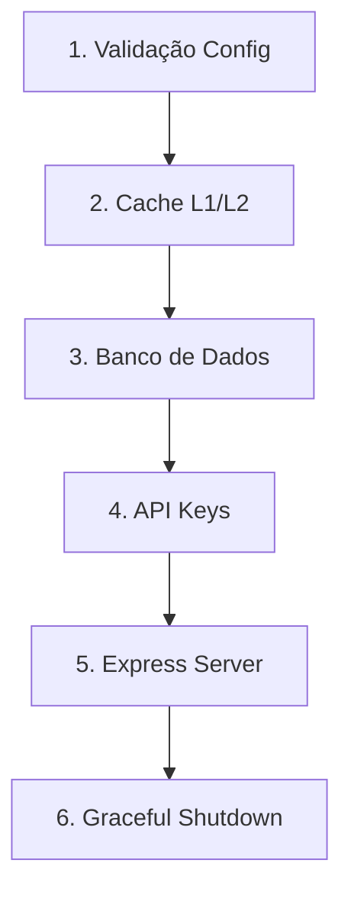
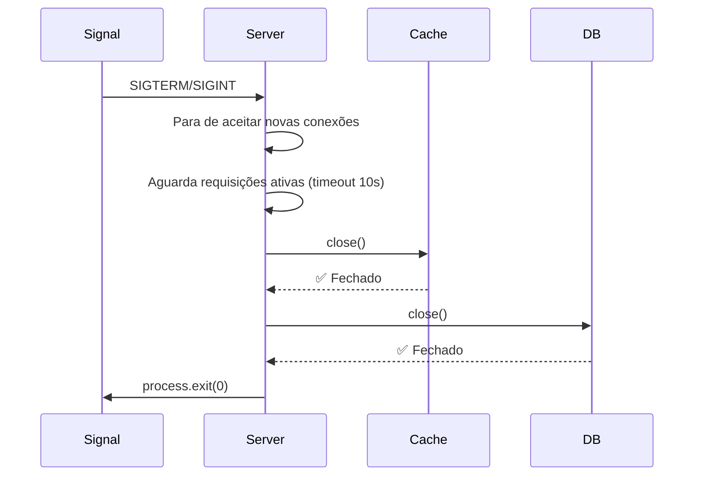

# Server - Inicialização da Aplicação

## 📋 Visão Geral

**Arquivo:** `src/server.ts`
**Tipo:** Entry Point / Bootstrap
**Responsabilidade:** Orquestrar a inicialização de todos os subsistemas da aplicação

O `server.ts` é o ponto de entrada da aplicação lor0138. É responsável por inicializar todos os componentes críticos em uma ordem específica e garantir que a aplicação seja encerrada de forma elegante (graceful shutdown).

---

## 🔄 Fluxo de Inicialização

### Sequência de Boot (6 Etapas)



#### **1️⃣ Validação de Configurações (Fail Fast)**

```typescript
configValidator.validate();
```

**Objetivo:** Identificar problemas de configuração ANTES de iniciar qualquer serviço.

**Validações realizadas:**
- ✅ Variáveis de ambiente obrigatórias presentes
- ✅ Formato de valores (PORT, HOST, TIMEOUT)
- ✅ Credenciais de banco de dados
- ✅ Configurações de cache (Redis, Memory)
- ✅ Estratégias válidas (`memory`, `redis`, `layered`)

**Comportamento:**
- ❌ **Erro fatal** → Aplicação não inicia
- ✅ **Sucesso** → Prossegue para próxima etapa

---

#### **2️⃣ Inicialização do Cache (L1/L2)**

```typescript
CacheManager.initialize(cacheStrategy);
```

**Estratégias disponíveis:**

| Estratégia | L1 (Memory) | L2 (Redis) | Uso Recomendado |
|-----------|-------------|------------|-----------------|
| `memory` | ✅ | ❌ | Desenvolvimento, testes |
| `redis` | ❌ | ✅ | Produção distribuída |
| `layered` | ✅ | ✅ | Produção alta performance |

**Comportamento com Redis indisponível:**
- **Estratégia `redis`/`layered`** → Fallback automático para L1 (memory)
- ⚠️ **Log de aviso** → "Redis não está pronto, usando fallback L1"
- ✅ **Aplicação continua** → Degradação controlada

**Variáveis de ambiente:**

```bash
CACHE_ENABLED=true               # Habilitar cache
CACHE_STRATEGY=layered           # memory | redis | layered
REDIS_HOST=localhost             # Host do Redis
REDIS_PORT=6379                  # Porta do Redis
CACHE_TTL=300                    # TTL padrão (segundos)
```

**Exemplo de logs:**

```
💾 Inicializando sistema de cache...
✅ Cache inicializado { strategy: 'layered', redis: 'conectado' }
📊 Cache stats: { l1: { hits: 0, misses: 0 }, l2: { hits: 0, misses: 0 } }
```

---

#### **3️⃣ Inicialização do Banco de Dados**

```typescript
await DatabaseManager.initialize();
```

**Modos de operação:**

| Modo | Descrição | Quando ocorre |
|------|-----------|---------------|
| `CONNECTED` | Conectado normalmente | Credenciais válidas |
| `MOCK_DATA` | Dados simulados | Erro de conexão |

**Tipos de banco suportados:**
- 🟦 **SQL Server** (Primary)
- 🟩 **PostgreSQL** (Secondary)
- 📦 **Mock Data** (Fallback)

**Fallback automático:**
1. Tenta conectar SQL Server
2. ❌ Falha → Tenta PostgreSQL
3. ❌ Falha → Usa Mock Data
4. ⚠️ **Log de aviso** → "Sistema em modo MOCK_DATA"

**Variáveis de ambiente:**

```bash
DB_TYPE=sqlserver                # sqlserver | postgres
DB_HOST=localhost
DB_PORT=1433
DB_USER=sa
DB_PASSWORD=StrongPass123
DB_DATABASE=lor0138
DB_POOL_MIN=2
DB_POOL_MAX=10
```

**Exemplo de logs:**

```
🗄️  Inicializando banco de dados...
✅ Banco de dados conectado { type: 'sqlserver', mode: 'CONNECTED' }
```

**Com fallback:**

```
🗄️  Inicializando banco de dados...
⚠️  Sistema em modo MOCK_DATA { type: 'mock', error: 'Connection timeout' }
```

---

#### **4️⃣ Inicialização do Sistema de API Keys**

```typescript
ApiKeyService.initialize();
```

**Carrega API Keys configuradas:**
- 🆓 **Free** → 100 req/dia
- 💎 **Premium** → 1.000 req/dia
- 🏢 **Enterprise** → 10.000 req/dia
- 👑 **Admin** → Ilimitado

**Estatísticas carregadas:**

```typescript
{
  total: 4,
  byTier: {
    free: 1,
    premium: 1,
    enterprise: 1,
    admin: 1
  }
}
```

**API Keys de exemplo (desenvolvimento):**

```
Free:       free-demo-key-123456
Premium:    premium-key-abc123
Enterprise: enterprise-key-xyz789
Admin:      admin-key-superuser
```

**Exemplo de logs:**

```
🔑 Inicializando sistema de API Keys...
✅ API Keys inicializadas { total: 4, byTier: { free: 1, premium: 1, ... } }
```

---

#### **5️⃣ Inicialização do Servidor HTTP (Express)**

```typescript
const server = app.getExpressApp().listen(PORT, HOST);
```

**Porta e Host:**

```bash
PORT=3000                        # Porta padrão
HOST=0.0.0.0                     # Aceita conexões externas
```

**URLs disponíveis após inicialização:**

| Endpoint | Descrição |
|----------|-----------|
| `/` | Raiz da API |
| `/api-docs` | Documentação Swagger UI |
| `/health` | Health check |
| `/cache/stats` | Estatísticas de cache |
| `/admin/api-keys` | Admin - Gestão de API Keys |

**Exemplo de logs:**

```
🌐 Inicializando servidor HTTP...
✅ Servidor HTTP iniciado {
  port: 3000,
  host: '0.0.0.0',
  url: 'http://lor0138.lorenzetti.ibe:3000',
  env: 'development',
  pid: 12345
}

📚 Documentação disponível {
  swagger: 'http://lor0138.lorenzetti.ibe:3000/api-docs',
  health: 'http://lor0138.lorenzetti.ibe:3000/health',
  cache: 'http://lor0138.lorenzetti.ibe:3000/cache/stats',
  admin: 'http://lor0138.lorenzetti.ibe:3000/admin/api-keys'
}
```

---

#### **6️⃣ Graceful Shutdown**

```typescript
setupGracefulShutdown(server, {
  timeout: 10000,
  onShutdownStart: async () => { ... },
  onShutdownComplete: () => { ... }
});
```

**Sinais capturados:**
- `SIGTERM` → Shutdown do Docker/Kubernetes
- `SIGINT` → Ctrl+C no terminal
- `uncaughtException` → Exceção não tratada
- `unhandledRejection` → Promise rejeitada sem catch

**Sequência de shutdown:**



**Timeout de shutdown:**

```bash
SHUTDOWN_TIMEOUT=10000           # 10 segundos (padrão)
```

**Exemplo de logs:**

```
🛑 Shutdown iniciado { pid: 12345, uptime: 3600.52 }
💾 Fechando conexões de cache...
✅ Cache fechado com sucesso
🗄️  Fechando conexões do banco de dados...
✅ Banco de dados fechado com sucesso
👋 Adeus! { pid: 12345, finalUptime: 3600.87 }
```

---

## 🔐 Type Guard: Validação de Cache Strategy

```typescript
function isValidCacheStrategy(value: string): value is 'memory' | 'redis' | 'layered' {
  return ['memory', 'redis', 'layered'].includes(value);
}
```

**Objetivo:** Garantir type safety em tempo de compilação.

**Comportamento:**

```typescript
// ✅ Válido
const strategy = isValidCacheStrategy('memory') ? 'memory' : 'memory';

// ❌ Inválido (fallback automático)
const invalidStrategy = 'invalid-strategy';
const strategy = isValidCacheStrategy(invalidStrategy)
  ? invalidStrategy  // TypeScript sabe que é 'memory' | 'redis' | 'layered'
  : 'memory';        // Fallback seguro
```

**Log de fallback:**

```
⚠️  Estratégia de cache inválida, usando fallback {
  provided: 'invalid-strategy',
  fallback: 'memory',
  validOptions: ['memory', 'redis', 'layered']
}
```

---

## 🚨 Tratamento de Erros Fatais

### Erro durante inicialização

```typescript
catch (error) {
  log.error('❌ Erro fatal ao iniciar servidor', {
    error: error instanceof Error ? error.message : 'Unknown error',
    stack: error instanceof Error ? error.stack : undefined,
  });

  // Tenta fechar conexões
  await CacheManager.close();
  await DatabaseManager.close();

  // Aguarda logs serem gravados
  setTimeout(() => {
    process.exit(1);
  }, 100);
}
```

**Comportamento:**
1. ❌ **Log de erro fatal** → Detalhes + stack trace
2. 🔄 **Tenta fechar conexões** → Cache + Database
3. ⏱️ **Aguarda 100ms** → Garante que logs sejam gravados
4. 🛑 **Encerra processo** → `process.exit(1)`

**Exemplo de log:**

```
❌ Erro fatal ao iniciar servidor {
  error: 'Database connection timeout',
  stack: 'Error: Database connection timeout\n    at ...'
}
💾 Fechando conexões de cache...
✅ Cache fechado com sucesso
🗄️  Fechando conexões do banco de dados...
❌ Erro ao fechar banco de dados { error: 'Connection already closed' }
```

---

## 📊 Logs de Inicialização Completos

### Sucesso (Happy Path)

```
🚀 Iniciando servidor lor0138...

📋 Validando configurações...
✅ Configurações válidas

💾 Inicializando sistema de cache...
✅ Cache inicializado { strategy: 'layered', redis: 'conectado' }

🗄️  Inicializando banco de dados...
✅ Banco de dados conectado { type: 'sqlserver', mode: 'CONNECTED' }

🔑 Inicializando sistema de API Keys...
✅ API Keys inicializadas { total: 4, byTier: { ... } }

🌐 Inicializando servidor HTTP...
✅ Servidor HTTP iniciado {
  port: 3000,
  host: '0.0.0.0',
  url: 'http://lor0138.lorenzetti.ibe:3000',
  env: 'production',
  pid: 12345
}

📚 Documentação disponível {
  swagger: 'http://lor0138.lorenzetti.ibe:3000/api-docs',
  health: 'http://lor0138.lorenzetti.ibe:3000/health',
  cache: 'http://lor0138.lorenzetti.ibe:3000/cache/stats',
  admin: 'http://lor0138.lorenzetti.ibe:3000/admin/api-keys'
}

🔑 API Keys de exemplo:
   Free:       free-demo-key-123456
   Premium:    premium-key-abc123
   Enterprise: enterprise-key-xyz789
   Admin:      admin-key-superuser

📊 Cache stats: { l1: { hits: 0, misses: 0 }, l2: { hits: 0, misses: 0 } }

🎉 Sistema pronto para receber requisições! {
  cache: 'layered',
  database: 'CONNECTED',
  apiKeys: 4,
  port: 3000
}
```

### Com Fallbacks

```
🚀 Iniciando servidor lor0138...

📋 Validando configurações...
✅ Configurações válidas

💾 Inicializando sistema de cache...
⚠️  Redis não está pronto, usando fallback L1 {
  strategy: 'layered',
  fallback: 'memory'
}
✅ Cache inicializado { strategy: 'memory' }

🗄️  Inicializando banco de dados...
⚠️  Sistema em modo MOCK_DATA {
  type: 'mock',
  error: 'Connection timeout after 5000ms'
}

🔑 Inicializando sistema de API Keys...
✅ API Keys inicializadas { total: 4, byTier: { ... } }

🌐 Inicializando servidor HTTP...
✅ Servidor HTTP iniciado { ... }

🎉 Sistema pronto para receber requisições! {
  cache: 'memory',
  database: 'MOCK_DATA',
  apiKeys: 4,
  port: 3000
}
```

---

## ⚙️ Variáveis de Ambiente

### Servidor HTTP

```bash
# Porta e host
PORT=3000
HOST=0.0.0.0

# Ambiente
NODE_ENV=development             # development | production | test
```

### Cache

```bash
# Habilitar cache
CACHE_ENABLED=true               # true | false

# Estratégia de cache
CACHE_STRATEGY=layered           # memory | redis | layered

# Configurações Redis (para redis/layered)
REDIS_HOST=localhost
REDIS_PORT=6379
REDIS_PASSWORD=                  # Opcional
REDIS_DB=0
CACHE_TTL=300                    # TTL padrão em segundos
```

### Banco de Dados

```bash
# Tipo de banco
DB_TYPE=sqlserver                # sqlserver | postgres

# Conexão
DB_HOST=localhost
DB_PORT=1433                     # 1433 (SQL) | 5432 (Postgres)
DB_USER=sa
DB_PASSWORD=StrongPass123
DB_DATABASE=lor0138

# Pool de conexões
DB_POOL_MIN=2
DB_POOL_MAX=10
DB_POOL_IDLE_TIMEOUT=30000
```

### Graceful Shutdown

```bash
# Timeout para finalizar requisições ativas
SHUTDOWN_TIMEOUT=10000           # 10 segundos (padrão)
```

---

## 🔍 Troubleshooting

### Problema: "Erro fatal ao iniciar servidor"

**Causa:** Configurações inválidas, banco inacessível, porta ocupada.

**Solução:**
1. Verificar logs para identificar etapa que falhou
2. Validar variáveis de ambiente (`.env`)
3. Testar conectividade com banco/redis manualmente
4. Verificar se porta está disponível: `lsof -i :3000`

---

### Problema: "Redis não está pronto, usando fallback L1"

**Causa:** Redis não está rodando ou inacessível.

**Impacto:** Cache funciona apenas em memória (L1), sem persistência entre instâncias.

**Solução:**
1. Verificar se Redis está rodando: `redis-cli ping`
2. Validar configurações: `REDIS_HOST`, `REDIS_PORT`
3. Verificar conectividade de rede
4. Em desenvolvimento, pode usar `CACHE_STRATEGY=memory`

---

### Problema: "Sistema em modo MOCK_DATA"

**Causa:** Não foi possível conectar a nenhum banco de dados (SQL Server ou PostgreSQL).

**Impacto:** API retorna dados simulados (mock), não persistirá alterações.

**Solução:**
1. Verificar se banco está rodando
2. Validar credenciais no `.env`
3. Testar conectividade manualmente
4. Verificar firewall/segurança

---

### Problema: "Aplicação não encerra após Ctrl+C"

**Causa:** Graceful shutdown não está funcionando, requisições longas ou recursos não liberados.

**Solução:**
1. Verificar timeout: `SHUTDOWN_TIMEOUT=10000`
2. Forçar encerramento: `Ctrl+C` duas vezes
3. Kill do processo: `kill -9 <PID>`
4. Revisar logs para identificar recurso preso

---

### Problema: "Port 3000 already in use"

**Causa:** Outra instância da aplicação ou outro processo usando a porta.

**Solução:**
1. Identificar processo: `lsof -i :3000`
2. Encerrar processo: `kill <PID>`
3. Ou usar outra porta: `PORT=3001 npm start`

---

## 📚 Dependências

### Módulos Importados

```typescript
import dotenv from 'dotenv';                        // Carregar .env
import { log } from '@shared/utils/logger';         // Sistema de logs
import { setupGracefulShutdown } from '@shared/utils/gracefulShutdown';
import { DatabaseManager } from './infrastructure/database/DatabaseManager';
import { App } from './app';                        // Express app
import { CacheManager } from '@shared/utils/cacheManager';
import { configValidator } from '@config/configValidator';
import { ApiKeyService } from '@shared/services/apiKey.service';
import { appConfig } from '@config/app.config';
```

---

## 🎯 Boas Práticas

### ✅ DO

- ✅ **Sempre validar configurações antes de iniciar** → Fail Fast
- ✅ **Usar fallbacks automáticos** → Degradação controlada
- ✅ **Logar cada etapa de inicialização** → Troubleshooting facilitado
- ✅ **Implementar graceful shutdown** → Evita perda de dados
- ✅ **Aguardar logs antes de encerrar** → `setTimeout(() => process.exit(1), 100)`

### ❌ DON'T

- ❌ **Iniciar servidor sem validar config** → Erro em produção
- ❌ **Ignorar erros de conexão** → Falhas silenciosas
- ❌ **Usar `process.exit(1)` imediatamente** → Logs não gravados
- ❌ **Esquecer de fechar conexões** → Conexões órfãs
- ❌ **Não implementar shutdown** → Perda de requisições ativas

---

## 🔗 Referências

- [App.ts](./app.ts) → Configuração do Express
- [DatabaseManager](./infrastructure/database/DatabaseManager.ts) → Gestão de conexões
- [CacheManager](./shared/utils/cacheManager.ts) → Cache L1/L2
- [configValidator](./config/configValidator.ts) → Validação de configurações
- [gracefulShutdown](./shared/utils/gracefulShutdown.ts) → Shutdown elegante

---

**Última atualização:** 2025-10-07